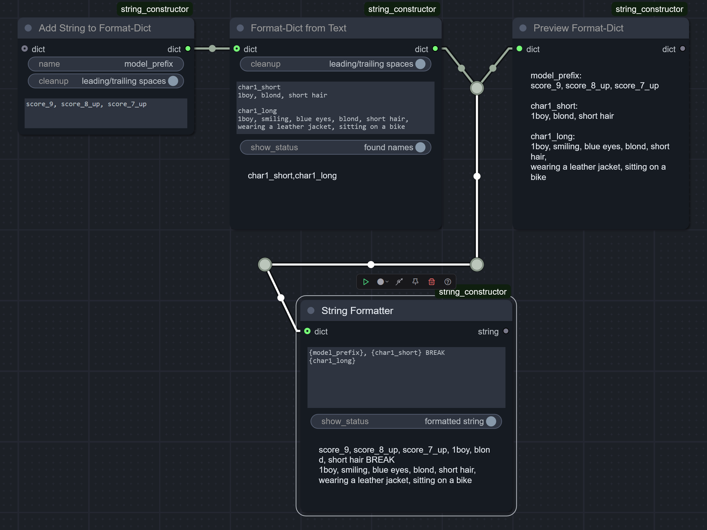

> "Do one thing and do it well." _— Peter H. Salus / Doug McIlroy, [core Unix principle](https://en.wikipedia.org/wiki/Unix_philosophy)_

> "Simple is better than complex." _— Zen of Python_

# `🗂️ Dict Tools` for ComfyUI

*Essential nodes to use dictionaries in ComfyUI: for smart prompt-formatting, general organization (passing a single connection instead of spaghetti), or anything else.* 

### TL;DR

- In python, there's a built-in "dictionary" (`dict`) data type.
- It's both simple and powerful: it's a single container that lets you put many pieces of data into it, **and still access them individually** - by their unique names aka keys. For example, you can put there:
  - `seed` (int)
  - `denoise` value (float)
  - `text` prompt (string)
  - ... and even have multiple versions of them for different stages of workflow - as long as each value has its own unique key.
- Even though ComfyUI actively uses dicts under the hood, there's no built-in `DICT` data type exposed to users, nor there are any nodes to build/modify/use dicts.
- This node pack aims to fix that.
- I **highly** recommend using it together with my [String Constructor/Formatter](https://github.com/Lex-DRL/ComfyUI-StringConstructor) node and with [Basic Data Handling](https://github.com/StableLlama/ComfyUI-basic_data_handling) pack.

## What for?

In short:
- Advanced text formatting;
- Utilizing the well-known "bus" workflow to reduce spaghetti, while letting **you** decide what data is contained inside the bus - not the node author deciding for you;
- Any other uses for dicts - your choice!

Now, specifics.

### Formatting

Originally, all these nodes were just a part of my [String Constructor pack](https://github.com/Lex-DRL/ComfyUI-StringConstructor) as "supporting" nodes. So they let you prepare a dictionary with various text chunks, and then build the actual prompt from them, easily reusing the same descriptions across the workflow. Like this:

### Bus connection

... but it quickly became apparent, that dicts are good not only for that - they're perfect as general-purpose "wrappers" over big sets of **any** data, no matter what is its type. So:
- You put all your seeds/prompts/denoise values/whatever (even models) into a single dictionary.
- You pass it as a **single** connection across the graph.
  - Yes, if you wish, also using any other spaghetti-reducing nodes - like `Set`/`Get` nodes from [KJNodes pack](https://github.com/kijai/ComfyUI-KJNodes) or any nodes from [UE pack](https://github.com/chrisgoringe/cg-use-everywhere).
- When needed, you extract these values back from the dict and connect them as usual. No special bus-understanding nodes required.

Also, dicts are designed to be easily updated, so you could initially build one "base" dict, another "override" dict, and somewhere down the workflow you apply the latter - getting a third dict which preserves all the original values from the first one, but takes the updated values from the second one.

This "base-then-override" approach lets you build your own templates containing entire **sets** of values, applied all at once with a single node when you need it. If you're familiar with Automatic1111 UI, then it's basically a "style preset" concept, but much, much, **MUCH** more flexible and powerful.

## Examples 🚧🏗️

(Section under construction)

## Implementation details for programmers

The exact datatype the nodes in this pack output is actually `frozendict` (not native `dict`) - to prevent accidentally mutating the same dict by multiple nodes.

## Versioning scheme

I adopted a custom versioning scheme, which looks like a regular SemVer, but is slightly different:
- First number is internal node-API version.
- Second is major update - when it bumps, it contains breaking changes.
- Last is a minor update.

## [TODO.md](TODO.md)
